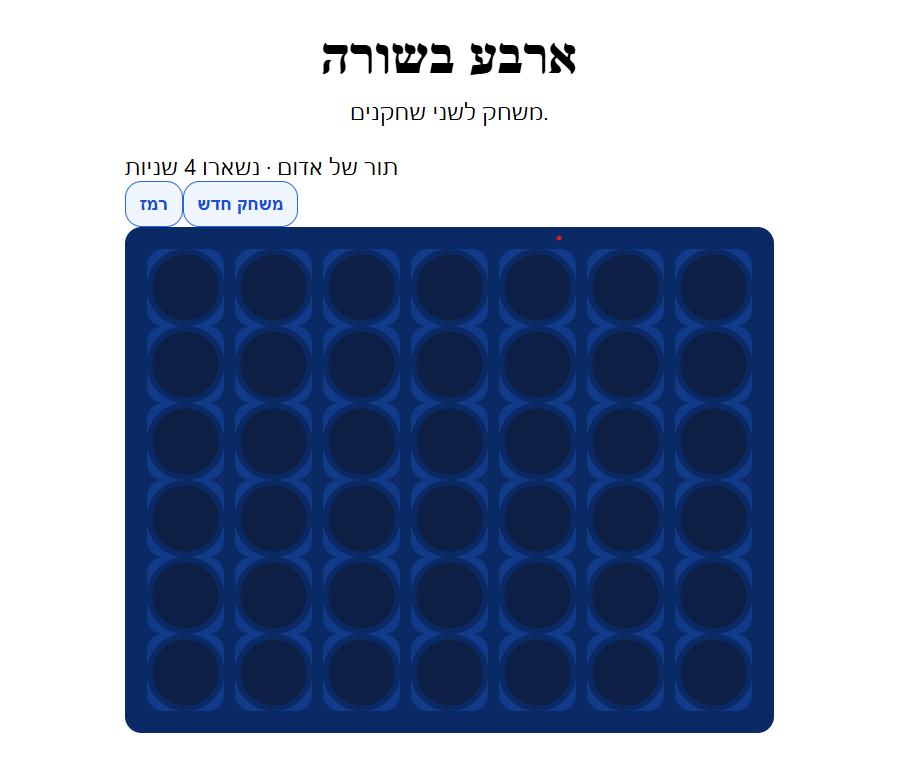

# 🎮 משחק ארבע בשורה – Connect Four (React + Vite)

👉 **[שחק עכשיו במשחק (לחץ כאן) ▶️](https://itay4560.github.io/connect-four/)**

משחק אינטראקטיבי של ארבע בשורה, בנוי בטכנולוגיות מודרניות – React + Vite.  
המשחק מאפשר לשני שחקנים להתחרות זה בזה בזמן אמת, כולל טיימרים, רמזים, ביטול מהלך ואפקטים גרפיים.

---

## 🖼️ תצוגת משחק

---

## ✨ פיצ'רים 

| יכולת | תיאור |
|-------|--------|
| 🟡 מערכת תורות דינמית | תור עובר בין אדום לצהוב בזמן אמת |
| ⏱ טיימר לכל שחקן | כל שחקן מקבל זמן מוגבל לבצע מהלך; אם הזמן נגמר – התור עובר |
| 🎯 זיהוי ניצחון חכם | בדיקה בכל ציר (אופקי / אנכי / אלכסוני) |
| 🖍️ סימון גרפי לניצחון | כאשר יש ניצחון – ארבעת המטבעות המנצחים מסומנים באופן בולט וברור |
| 🎬 אנימציה להפלת מטבע | מטבע "נופל" מגובה אל התא המדויק – מוסיף תחושה של משחק אמיתי |
| ♻️ כפתור ביטול מהלך (Undo) | מאפשר לחזור למהלך הקודם |
| 🔄 כפתור התחלה מחדש (Restart) | איפוס המשחק |
| 🧠 כפתור רמז | מסמן לשחקן אם קיימת אפשרות לניצחון |
| 👁️ תצוגת מצב שוטף | הצגת הזמן שנותר, תור נוכחי ומצב המשחק |

---
